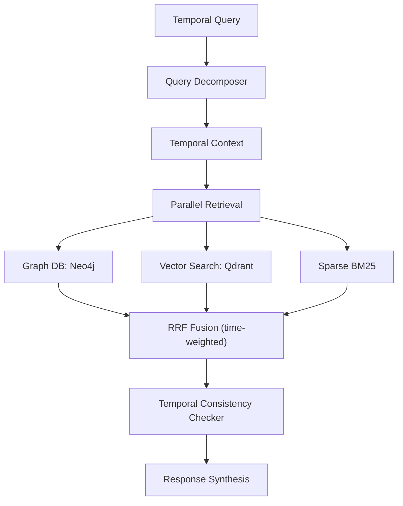
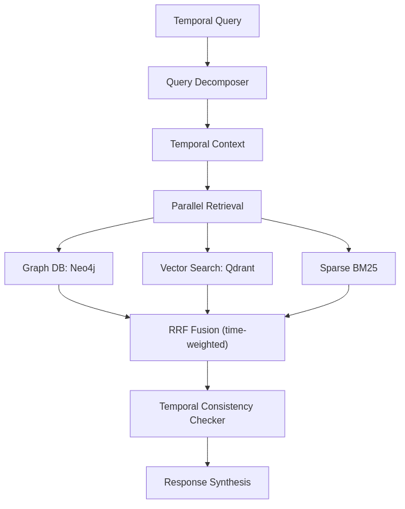
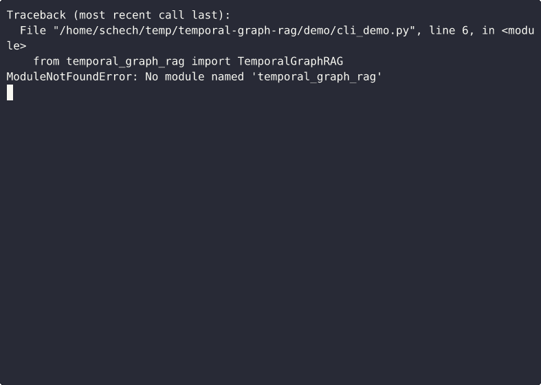
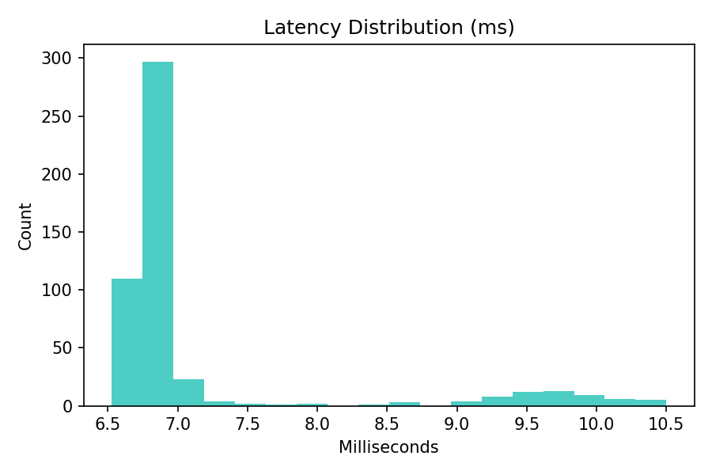
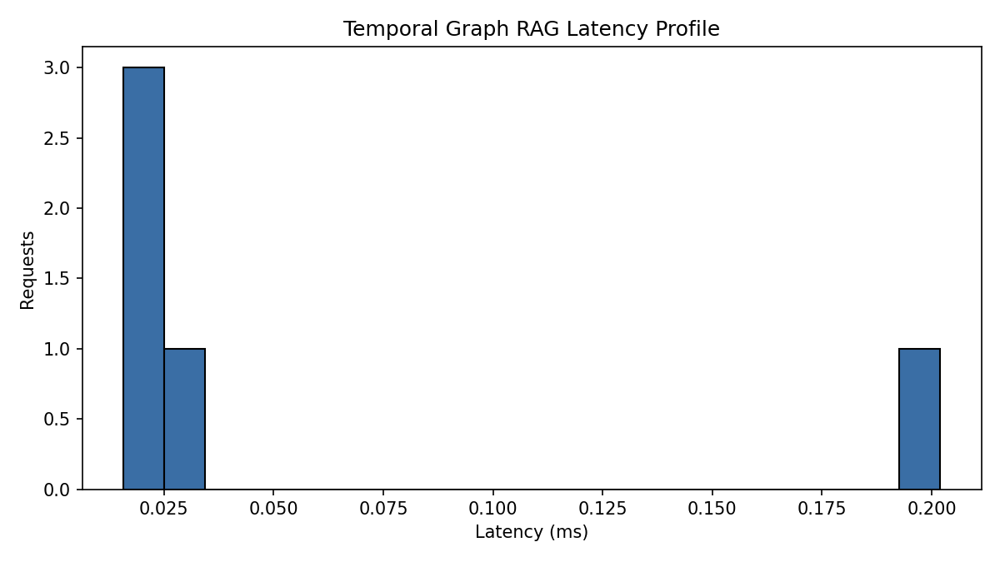

# Temporal Graph RAG

[](https://www.python.org/downloads/)
[](https://neo4j.com/)
[](https://qdrant.tech/)
[](LICENSE)
[](https://github.com/Schechter-Edward/temporal-graph-rag/actions/workflows/benchmark.yml)
[](https://github.com/Schechter-Edward/temporal-graph-rag/actions/workflows/tests.yml)

> Production-grade retrieval system that understands time.
>
> Standard RAG treats documents as timeless. This engine respects temporal validity, handles
> before/after/during queries, and detects timeline contradictions via Allen's interval algebra.

## 30-Second Scan

- Problem: standard RAG ignores time, so answers are wrong.
- Solution: hybrid retrieval (Dense + Sparse + Graph) with temporal validity + consistency checks.
- Signal: reproducible benchmarks, latency profiling, and CI for tests/benchmarks.

## Why This Exists

Standard RAG fails on temporal questions:
- "Who managed the team **before** Sarah?" -> returns current manager
- "What was revenue **during Q3 2023**?" -> returns Q4 2024 numbers
- "Was Alice on vacation **when** the outage happened?" -> ignores dates entirely

This system:
- Bitemporal modeling (valid time + transaction time)
- Hybrid retrieval (Graph + Dense + Sparse) with temporal weighting
- Temporal consistency checking (detects contradictions)
- OpenAPI-first API + structured outputs

## Architecture



Render a PNG for your README screenshots:

```bash
./scripts/render_architecture.sh assets/architecture.mmd assets/architecture.png
```



## Project Status

This repo is a runnable prototype with a clean path to production:
- Core temporal algebra and retrieval fusion are implemented.
- Storage backends (Neo4j/Qdrant/BM25) are currently in-memory placeholders.
- API is stable and documented below; wiring real backends is the next step.

## Quick Start (Pop!_OS)

```bash
# One-time setup
chmod +x infrastructure/setup_popos.sh
./infrastructure/setup_popos.sh

# Launch stack
docker compose -f infrastructure/docker-compose.yml up -d

# Run API
uvicorn temporal_graph_rag.api.main:app --reload --port 8000
```

## Local Dev (Any OS)

```bash
python -m venv .venv
source .venv/bin/activate
pip install -e .[dev,bench]
uvicorn temporal_graph_rag.api.main:app --reload --port 8000
```

## CLI Demo (and GIF)

```python
from datetime import datetime
from temporal_graph_rag import TemporalGraphRAG

engine = TemporalGraphRAG()
response = engine.query(
    "Who managed the infrastructure team before the March 2024 reorg?",
    reference_time=datetime(2024, 6, 1)
)
print(response.answer)
```

Run a CLI demo:

```bash
python demo/cli_demo.py \"Who managed infrastructure before the March 2024 reorg?\" --reference-time 2024-06-01T00:00:00
```

Record a GIF for your README (optional):

```bash
./scripts/record_demo.sh assets/demo.cast assets/demo.gif
```



## API

POST `/query`

```bash
curl -X POST http://localhost:8000/query \
  -H "Content-Type: application/json" \
  -d '{
    "query": "Who led Project Orion before 2024?",
    "reference_time": "2024-06-01T00:00:00Z"
  }'
```

Example response:

```json
{
  "answer": "Query: Who led Project Orion before 2024?\nTemporal bounds: 2024-01-01 00:00:00 -> 2024-12-31 00:00:00\n- Alice led Project Orion from 2023-01 to 2024-02. (source=graph, valid=2023-01-01 00:00:00..2024-02-28 00:00:00)",
  "sources": [
    {
      "doc_id": "doc-1",
      "content": "Alice led Project Orion from 2023-01 to 2024-02.",
      "source": "graph",
      "score": 0.9,
      "valid_from": "2023-01-01T00:00:00",
      "valid_to": "2024-02-28T00:00:00"
    }
  ],
  "temporal_context": {
    "reference_time": "2024-06-01T00:00:00Z",
    "operators": ["BEFORE"],
    "time_start": "2024-01-01T00:00:00",
    "time_end": "2024-12-31T00:00:00",
    "granularity": "year"
  }
}
```

## Benchmarks (Synthetic, Reproducible)

```bash
python benchmarks/temporal_hotpot.py --visualize
```

Produces `assets/benchmark_results.png` and a console summary comparing vanilla vs temporal RAG.

Latest run (synthetic, 50 samples):

| Metric | Result |
| --- | --- |
| Temporal accuracy | 100.00% |
| P99 latency | 0.1 ms |



## Latency Profile

```bash
python benchmarks/latency_profile.py --samples 80 --out assets/latency_profile.png
```



## Evaluation Stub (ARES-style)

This is a CSV output stub you can wire into ARES or an LLM judge later.

```bash
python evaluation/ares_eval.py --input data/eval_samples.jsonl --output assets/ares_eval.csv
```

Expected JSONL format (one record per line):

```json
{"query":"...","answer":"...","contexts":["..."],"ground_truth":"..."}
```

## Repository Structure

```
temporal-graph-rag/
├── assets/                     # Charts and diagrams
├── benchmarks/                 # Reproducible benchmarking
├── demo/                       # CLI demo used for GIFs
├── evaluation/                 # Evaluation stubs + CSV output
├── infrastructure/             # Docker compose + Pop!_OS setup
├── notebooks/                  # Colab demo notebook
├── scripts/                    # Render diagrams + record demos
├── src/temporal_graph_rag/      # Package source
├── tests/                      # Temporal algebra + retrieval tests
└── .github/workflows/           # CI checks
```

## Key Features

1) Temporal Query Decomposition
- Extracts temporal operators and bounds (BEFORE/AFTER/DURING/BETWEEN)

2) Bitemporal Graph Model
- Stores valid-time and transaction-time intervals on edges

3) Hybrid Retrieval + Temporal RRF
- RRF fusion weighted by time proximity and source reliability

4) Temporal Consistency Checker
- Detects contradictions like overlapping exclusive states

## Tech Stack

- Graph: Neo4j 5.x
- Vector: Qdrant
- Sparse: BM25 (rank-bm25)
- API: FastAPI + Pydantic v2
- Observability: OpenTelemetry (hook-ready)
- Local Models: Ollama (optional)
- Cloud Models: OpenAI (optional)

## Contributing

See `CONTRIBUTING.md`. Please follow the `CODE_OF_CONDUCT.md`.

## Security

Please report issues per `SECURITY.md`.

## Contact

Built by Edward Schechter.
- Email: schechtereddie@gmail.com
- LinkedIn: www.linkedin.com/in/edward-3-100s

## Roadmap

- Swap in real Neo4j/Qdrant backends behind retrieval interfaces
- Add real-world temporal datasets + evaluation harness
- Expand temporal parsing (quarters, fiscal years, natural language)
- Add provenance + contradiction explanations in API response

## License

MIT. See `LICENSE`.
